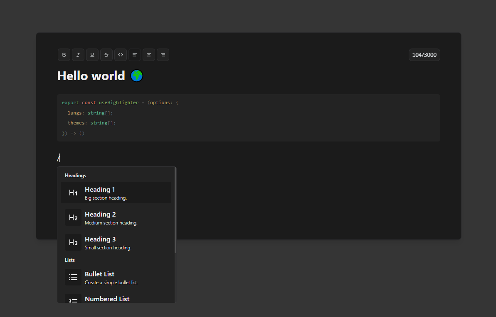

<p align="center">
  <p align="center">
   
  </p>
	<h1 align="center"><b>Eddies</b></h1>
	<p align="center">
<a href="https://www.npmjs.com/packages/eddies" target="_blank"></a>
<a href="https://www.npmjs.com/packages/eddies" target="_blank"></a>
<a href="https://www.npmjs.com/packages/eddies" target="_blank"></a>
<a href="https://www.npmjs.com/packages/eddies" target="_blank"></a>
<a href="https://github.com/malezjaa/eddies/graphs/commit-activity" target="_blank"></a>
<a href="https://github.com/malezjaa/eddies/stargazers" target="_blank"></a>
  </p>
</p>

> [!IMPORTANT]
> If you encounter any error with the documentation or with the code itself please report it.

<p align="center">

<p>

## Quick start

```bash
pnpm install eddies
```

Using editor:

```tsx
import { Editor } from "eddies";

export default function Page() {
  return (
    <div className="m-5">
      <Editor />
    </div>
  );
}
```

## Props

| Prop                  | Type                                                                          | Description                                     |
| --------------------- | ----------------------------------------------------------------------------- | ----------------------------------------------- |
| `className?`          | `string`                                                                      | The class name to use for the editor.           |
| `theme?`              | `"light" \| "dark"`                                                           | Defines the editor's theme.                     |
| `showCharacterCount?` | `boolean`                                                                     | Show character count.                           |
| `limit?`              | `number`                                                                      | The limit of characters.                        |
| `menu?`               | `boolean`                                                                     | Shows menu above the editor.                    |
| `bubbleMenuItems?`    | `BubbleMenuItem[] \| { includeDefault?: boolean; items?: BubbleMenuItem[]; }` | Items that will be displayed in bubble menu.    |
| `onReady?`            | `(editor: EddiesEditor) => void`                                              | Triggered when the editor is ready.             |
| `onContentChange?`    | `(editor: EddiesEditor) => void`                                              | Triggered on every content change.              |
| `initialValue?`       | `Content`                                                                     | Content shown every time the editor is created. |
| `extensions`          | `Extensions`                                                                  | Extensions to add to the editor.                |
| `placeholder?`        | `PlaceholderOptions`                                                          | The placeholder text when the editor is empty.  |
| `isEditable?`         | `boolean`                                                                     | Disables the editor.                            |
| `autofocus?`          | `FocusPosition`                                                               | Auto focus settings                             |
| `keyboardShortcuts?`  | `Record<string, KeyboardShortcutCommand>`                                     | Custom keyboard shortcuts.                      |
| `tiptapOptions?`      | `Partial<TiptapEditorOptions>`                                                | Editor props to pass to the editor.             |

## Contributing

Pull requests and stars are always welcome. See [`contributing.md`](.github/contributing.md) for ways to get started.

This repository has a [`code of conduct`](.github/CODE_OF_CONDUCT.md). By interacting with this repository, organization, or community you agree to abide by its terms.

[MIT][license] © [malezjaa][author]

Logo by [iconixar](https://www.flaticon.com/authors/iconixar)

[license]: license
[author]: https://github.com/malezjaa
